# project-template-2026

TypeScript モノレポのテンプレート。Node.js 上の Hono バックエンドと React/Vite フロントエンドを、
Hono RPC クライアントによるエンドツーエンドの型安全性でつなぐ。

サンプルとして**認証付きのタスク管理アプリ**が動く状態で入っている。認証は OAuth 2.0 の
authorization code + PKCE を BFF（Backend-For-Frontend）パターンで実装しており、ブラウザには
トークンを一切渡さない。インフラは AWS CDK で、Aurora DSQL・Lambda・CloudFront・Cognito に
デプロイできる。

## 技術スタック

| 領域           | 採用技術                                                           |
| -------------- | ------------------------------------------------------------------ |
| ランタイム     | Node.js v24（ネイティブの TypeScript 型ストリッピング）            |
| モノレポ       | pnpm workspaces（`apps/*`, `packages/*`）                          |
| パッケージ管理 | pnpm v11                                                           |
| バックエンド   | Hono on Node.js（`@hono/node-server`）                             |
| フロントエンド | React + Vite + Tailwind v4 + shadcn/ui（Base UI）                  |
| フロント設計   | Feature-Sliced Design (FSD v2.1) + steiger による検査              |
| データ層       | Hono RPC クライアント + TanStack Query（エンドツーエンドで型付け） |
| DB             | drizzle ORM（本番は Aurora DSQL、ローカルは Postgres）             |
| 認証           | OAuth BFF パターン（本番は Cognito、ローカルは oidc-server-mock）  |
| インフラ       | AWS CDK (TypeScript)                                               |
| Lint/format    | oxlint + oxfmt                                                     |
| テスト         | Vitest（backend は PGlite 上で実行）                               |
| Hooks / CI     | husky + lint-staged · GitHub Actions                               |

## 構成

```
apps/
  backend/   Hono の BFF — /auth（OAuth 遷移）と /me・/tasks（JSON API）を提供し、AppType を公開
  frontend/  React SPA（FSD）— TanStack Query + Hono RPC でバックエンドを型付きで呼ぶ
  iac/       AWS CDK — フロント配信・API・Cognito・DB・セッションテーブル
packages/
  db/              @icasu/db — drizzle のスキーマ / DB クライアント / マイグレーション
  backend-auth/    @icasu/backend-auth — BFF 認証（OIDC 認可コード + PKCE）の Hono app
  simple-result/   @icasu/simple-result — 失敗を throw せず値で返す最小の Result<T, E>
```

依存の向きは `apps/*` → `packages/*` の一方向のみ。

## はじめ方

### 前提

- **Docker**（必須）— ローカルの DB・セッションストア・OIDC プロバイダを docker-compose の
  エミュレータで動かす。AWS 認証情報は不要。
- **[mise](https://mise.jdx.dev)**（推奨）— ツールチェーン（Node.js v24 + pnpm v11）を `mise.toml`
  に固定してある。使わない場合は Node.js v24 以上（`.node-version` を参照）と pnpm v11 が PATH に
  あればよい。

### セットアップ

```bash
mise install                                       # Node v24 + pnpm v11
pnpm install

cp apps/backend/.env.example apps/backend/.env     # OIDC / Cookie / DynamoDB のローカル既定値
cp packages/db/.env.example packages/db/.env       # db:migrate が読む DATABASE_URL

pnpm local:up                                      # Postgres + DynamoDB Local + OIDC mock
pnpm db:migrate                                    # ローカル Postgres にスキーマを適用
pnpm dev                                           # backend (:3001) + frontend (:5001)
```

`.env` を用意せずに `pnpm dev` すると、バックエンドは起動時の設定検証（`loadAuthConfigFromEnv`）で
即座に落ちる。`pnpm db:migrate` は初回とスキーマ変更時のみ必要。

### ログイン

http://localhost:5001 を開くと、`/me`・`/tasks` が認証必須のため OIDC のログイン画面へリダイレクト
される。oidc-server-mock に事前定義したユーザーでログインするとタスク一覧に戻る:

| ユーザー | パスワード | `sub`         |
| -------- | ---------- | ------------- |
| `member` | `member`   | `member-user` |
| `admin`  | `admin`    | `admin-user`  |

ユーザーは `docker/oidc-server-mock/users.json` で定義する。role は DB 側の責務で、どちらのユーザーも
初回アクセス時に JIT で `role='member'` の行が作られる。admin として認可を通すには
`update users set role='admin' where user_sub='admin-user';` で昇格する
（認可の設計は [`apps/backend/CLAUDE.md`](apps/backend/CLAUDE.md)「認証・認可」節）。

バックエンドはネイティブの型ストリッピングにより `.ts` を Node.js で直接実行する — ビルドステップは
不要。開発時は Vite が `/api/*`・`/auth/*` をバックエンドへプロキシする。

## ローカル構成

`pnpm local:up` + `pnpm dev` で立ち上がるローカル開発時の構成。DB・セッションストア・
OIDC プロバイダは docker-compose のエミュレータで代替するため、AWS 認証情報は不要。

```mermaid
architecture-beta
    service pg(logos:postgresql)[Postgres 5432]
    service ddb(logos:aws-dynamodb)[DynamoDB Local 8000]
    junction jct1
    service bff(logos:hono)[Hono BFF 3001]
    service vite(logos:vite)[Vite Dev Server 5001]
    service oidc(server)[oidc server mock 8080]
    junction jct2
    service browser(internet)[Browser]

    browser:L -- R:jct2
    jct2:T --> B:oidc
    browser:T --> B:vite
    vite:T --> B:bff
    bff:T -- B:jct1
    jct1:L --> R:ddb
    jct1:R --> L:pg
```



| リソース                   | 説明                                                                                                 |
| -------------------------- | ---------------------------------------------------------------------------------------------------- |
| Browser                    | ユーザーのブラウザ。SPA を表示し、OAuth のログイン/ログアウトは oidc-server-mock へ直接遷移する。    |
| Vite Dev Server (`:5001`)  | フロントの開発サーバ。SPA を配信し、`/api/*`・`/auth/*` を Hono BFF へプロキシする。                 |
| Hono BFF (`:3001`)         | Hono バックエンド。JSON API（`/me`・`/tasks`）と OAuth 遷移（`/auth`）を処理し、セッションを検証。   |
| Postgres (`:5432`)         | アプリデータ（tasks など）の DB（drizzle 経由）。docker-compose のエミュレータ。本番は Aurora DSQL。 |
| DynamoDB Local (`:8000`)   | 不透明セッション + 一時 state のストア。docker-compose のエミュレータ。本番は DynamoDB。             |
| oidc-server-mock (`:8080`) | ローカル用の OIDC プロバイダ。docker-compose のエミュレータ。本番は Cognito。                        |

## クラウド構成（AWS）

`pnpm cdk:deploy`（AWS CDK / `apps/iac`）でデプロイする本番相当の構成。ローカルの
エミュレータは、CloudFront + S3（SPA 配信）、API Gateway + Lambda（Hono BFF）、
Aurora DSQL（アプリ DB）、DynamoDB（セッション）、Cognito（OIDC）に置き換わる。

```mermaid
architecture-beta
    group aws(logos:aws)[AWS]
    service dsql(logos:aws-aurora)[Aurora DSQL] in aws
    service ddb(logos:aws-dynamodb)[DynamoDB Sessions] in aws
    junction jct1 in aws
    service lambda(logos:aws-lambda)[Lambda Hono BFF] in aws
    service apigw(logos:aws-api-gateway)[API Gateway HTTP API] in aws
    service s3(logos:aws-s3)[S3 SPA assets] in aws
    service cf(logos:aws-cloudfront)[CloudFront] in aws
    service cognito(logos:aws-cognito)[Cognito Hosted UI] in aws
    junction jct2
    service browser(internet)[Browser]

    browser:L -- R:jct2
    jct2:T --> B:cognito
    browser:T --> B:cf
    cf:R --> L:s3
    cf:T --> B:apigw
    apigw:T --> B:lambda
    lambda:T -- B:jct1
    jct1:L --> R:ddb
    jct1:R --> L:dsql
```



CloudFront が全リクエスト（SPA・`/api`・`/auth`）の単一エントリになり、認証は Lambda 内の
セッションミドルウェアが担う（API Gateway に authorizer は付けない）。`STAGE`（`dev` / `prod`）
以外の設定は `apps/iac/src/config.ts` に定数で持つ。

スタック構成・各リソースの詳細・デプロイ手順・DSQL のアプリ側 follow-up は
[`apps/iac/README.md`](apps/iac/README.md) を参照。

## スクリプト（リポジトリルートから実行）

| コマンド            | 説明                                                     |
| ------------------- | -------------------------------------------------------- |
| `pnpm dev`          | 両アプリを起動                                           |
| `pnpm dev:backend`  | バックエンドのみ                                         |
| `pnpm dev:frontend` | フロントエンドのみ                                       |
| `pnpm build`        | 両アプリをビルド                                         |
| `pnpm test`         | 全テストを実行（Docker 不要 — backend は PGlite で実行） |
| `pnpm typecheck`    | 全ワークスペースを型チェック                             |
| `pnpm lint`         | oxlint                                                   |
| `pnpm lint:fix`     | oxlint（自動修正）                                       |
| `pnpm format`       | oxfmt（書き込み）                                        |
| `pnpm format:check` | oxfmt（チェックのみ — CI で使用）                        |
| `pnpm steiger`      | フロントの FSD アーキテクチャ検査                        |
| `pnpm local:up`     | ローカル基盤の起動（DB + DynamoDB + OIDC mock）          |
| `pnpm db:up`        | DB コンテナのみ起動                                      |
| `pnpm db:down`      | ローカル基盤の停止                                       |
| `pnpm db:generate`  | スキーマ変更から drizzle マイグレーションを生成          |
| `pnpm db:migrate`   | マイグレーションをローカル Postgres に適用               |
| `pnpm db:push`      | スキーマを直接反映（マイグレーション無し。開発用）       |
| `pnpm db:studio`    | drizzle studio を起動                                    |
| `pnpm cdk:synth`    | CDK スタックを synth                                     |
| `pnpm cdk:diff`     | CDK スタックの差分を表示                                 |
| `pnpm cdk:deploy`   | CDK スタックをデプロイ                                   |

## 開発の作法

### コミット前に通すもの

CI（`.github/workflows/ci.yml`）が回すのは次の5つ。ローカルでも同じものを通す:

```bash
pnpm lint && pnpm steiger && pnpm format:check && pnpm typecheck && pnpm test
```

`pnpm steiger` はフロントの FSD レイヤー違反（import の逆流など）を検出する。husky + lint-staged が
pre-commit でステージ済みファイルに oxfmt / oxlint --fix を掛けるが、typecheck・test・steiger は
掛からないので手元で通しておく。`git commit --no-verify` は使用禁止。

### 依存の追加・更新

registry は Takumi Guard プロキシ（npm.flatt.tech）、`pnpm-workspace.yaml` には
`minimumReleaseAge`（21 日）を設定しているため、素の pnpm とは挙動が違う。**publish 直後の
パッケージはインストールできない**（`ERR_PNPM_NO_MATURE_MATCHING_VERSION`）。回避には
`minimumReleaseAgeExclude` を使うが、これは期日コメント付きの一時的な措置とする。

`pnpm-lock.yaml` を変更したらコミット前に cold cache で検証すること（pnpm は supply-chain policy の
検査結果をキャッシュするため、手元の `pnpm install` が通っても CI で落ちることがある）。詳細と
検証スクリプトは `.claude/skills/pnpm-dependencies/` にある。

## 型安全な API 呼び出し

バックエンドはアプリの型を公開する:

```ts
// apps/backend/src/app.ts
export type AppType = ReturnType<typeof createApp>;
```

フロントエンドはこれを Hono RPC クライアント（`apps/frontend/src/shared/api/index.ts`）経由で
取り込むため、ルートとレスポンスが完全に型付けされ、補完も効く。フロントがバックエンドに持つ依存は
この `AppType` 一本に集約し、backend の内部モジュール（zod スキーマなど）は runtime import しない。

## ドキュメント

設計判断と背景は各パッケージの `CLAUDE.md` に集約している。

| ドキュメント                                                         | 内容                                                               |
| -------------------------------------------------------------------- | ------------------------------------------------------------------ |
| [`CLAUDE.md`](CLAUDE.md)                                             | モノレポ全体の規約（構成・コメント方針・コミット/ツール導入）      |
| [`apps/backend/CLAUDE.md`](apps/backend/CLAUDE.md)                   | 合成点・公開面（`AppType` 一本）・入力検証・認証/認可              |
| [`apps/frontend/CLAUDE.md`](apps/frontend/CLAUDE.md)                 | Feature-Sliced Design (FSD v2.1)・ルーティング・shadcn の追加      |
| [`apps/iac/CLAUDE.md`](apps/iac/CLAUDE.md)                           | CDK の規約（`STAGE` のみ・context 不使用・`CfnOutput` 不使用）     |
| [`packages/db/CLAUDE.md`](packages/db/CLAUDE.md)                     | DSQL 互換のスキーマルール・自前マイグレーションランナー            |
| [`packages/backend-auth/CLAUDE.md`](packages/backend-auth/CLAUDE.md) | BFF 認証の設計・公開 API・テスト方針                               |
| [`docs/specs/authentication.md`](docs/specs/authentication.md)       | 認証のシーケンス図（ログイン・ログアウト・リフレッシュ・API 保護） |
