# project-template-2026

TypeScript モノレポのテンプレート。Node.js 上の Hono バックエンドと React/Vite フロントエンドを、
Hono RPC クライアントによるエンドツーエンドの型安全性でつなぐ。

## 技術スタック

| 領域           | 採用技術                                                           |
| -------------- | ------------------------------------------------------------------ |
| ランタイム     | Node.js v24（ネイティブの TypeScript 型ストリッピング）            |
| モノレポ       | pnpm workspaces（`apps/*`, `packages/*`）                          |
| パッケージ管理 | pnpm                                                               |
| バックエンド   | Hono on Node.js（`@hono/node-server`）                             |
| フロントエンド | React + Vite + Tailwind v4 + shadcn/ui（Base UI）                  |
| データ層       | Hono RPC クライアント + TanStack Query（エンドツーエンドで型付け） |
| Lint/format    | oxlint + oxfmt                                                     |
| テスト         | Vitest（両アプリ）                                                 |
| Hooks / CI     | husky + lint-staged · GitHub Actions                               |

## 構成

```
apps/
  backend/   Hono API — GET /hello-world を提供し、RPC 用に AppType を公開
  frontend/  React アプリ — TanStack Query 経由でバックエンドのメッセージを表示
packages/    （共有パッケージ用に予約）
```

認証（OAuth BFF パターン）のログイン・ログアウト・トークンリフレッシュ・API 保護の
シーケンス図と設計は [`docs/specs/authentication.md`](docs/specs/authentication.md) を参照。

## ローカル構成

`pnpm local:up` + `pnpm dev` で立ち上がるローカル開発時の構成。DB・セッションストア・
OIDC プロバイダは docker-compose のエミュレータで代替するため、AWS 認証情報は不要。

```mermaid
architecture-beta
    service pg(logos:postgresql)[Postgres 5432]
    service ddb(logos:aws-dynamodb)[DynamoDB Local 8000]
    junction jct1
    service bff(logos:hono)[Hono BFF 3001]
    service vite(logos:vite)[Vite Dev Server 5001]
    service oidc(server)[mock oauth2 server 8080]
    junction jct2
    service browser(internet)[Browser]

    browser:L -- R:jct2
    jct2:T --> B:oidc
    browser:T --> B:vite
    vite:T --> B:bff
    bff:T -- B:jct1
    jct1:L --> R:ddb
    jct1:R --> L:pg
```



| リソース                     | 説明                                                                                                 |
| ---------------------------- | ---------------------------------------------------------------------------------------------------- |
| Browser                      | ユーザーのブラウザ。SPA を表示し、OAuth のログイン/ログアウトは mock-oauth2 へ直接遷移する。         |
| Vite Dev Server (`:5001`)    | フロントの開発サーバ。SPA を配信し、`/api/*`・`/auth/*` を Hono BFF へプロキシする。                 |
| Hono BFF (`:3001`)           | Hono バックエンド。JSON API（`/me`・`/tasks`）と OAuth 遷移（`/auth`）を処理し、セッションを検証。   |
| Postgres (`:5432`)           | アプリデータ（tasks など）の DB（drizzle 経由）。docker-compose のエミュレータ。本番は Aurora DSQL。 |
| DynamoDB Local (`:8000`)     | 不透明セッション + 一時 state のストア。docker-compose のエミュレータ。本番は DynamoDB。             |
| mock-oauth2-server (`:8080`) | ローカル用の OIDC プロバイダ。docker-compose のエミュレータ。本番は Cognito。                        |

## クラウド構成（AWS）

`pnpm cdk:deploy`（AWS CDK / `apps/iac`）でデプロイする本番相当の構成。ローカルの
エミュレータは、CloudFront + S3（SPA 配信）、API Gateway + Lambda（Hono BFF）、
Aurora DSQL（アプリ DB）、DynamoDB（セッション）、Cognito（OIDC）に置き換わる。

```mermaid
architecture-beta
    group aws(logos:aws)[AWS]
    service dsql(logos:aws-aurora)[Aurora DSQL] in aws
    service ddb(logos:aws-dynamodb)[DynamoDB Sessions] in aws
    junction jct1 in aws
    service lambda(logos:aws-lambda)[Lambda Hono BFF] in aws
    service apigw(logos:aws-api-gateway)[API Gateway HTTP API] in aws
    service s3(logos:aws-s3)[S3 SPA assets] in aws
    service cf(logos:aws-cloudfront)[CloudFront] in aws
    service cognito(logos:aws-cognito)[Cognito Hosted UI] in aws
    junction jct2
    service browser(internet)[Browser]

    browser:L -- R:jct2
    jct2:T --> B:cognito
    browser:T --> B:cf
    cf:R --> L:s3
    cf:T --> B:apigw
    apigw:T --> B:lambda
    lambda:T -- B:jct1
    jct1:L --> R:ddb
    jct1:R --> L:dsql
```



| リソース               | 説明                                                                                                                   |
| ---------------------- | ---------------------------------------------------------------------------------------------------------------------- |
| Browser                | ユーザーのブラウザ。SPA を表示し、OAuth のログイン/ログアウトは Cognito Hosted UI へ直接遷移する。                     |
| CloudFront             | 全リクエスト（SPA・`/api`・`/auth`）の単一エントリ。S3 と API Gateway をオリジンに束ね、HTTPS を強制する。             |
| S3                     | SPA の静的アセットを保持するバケット（private + OAC）。CloudFront Function で SPA フォールバック。                     |
| API Gateway (HTTP API) | `/api/*`（先頭 `/api` 除去）・`/auth/*`（除去なし）を Lambda へ転送する。authorizer は付けない。                       |
| Lambda (Hono BFF)      | Hono バックエンド。認証は Lambda 内のセッションミドルウェアが担い、confidential client として Cognito と通信。         |
| Aurora DSQL            | アプリデータ（tasks など）のサーバーレス DB（IAM トークン認証、drizzle 経由）。ローカルの Postgres 相当。              |
| DynamoDB               | 不透明セッション + 一時 state（`sess#`／`state#`）のストア。TTL で自動失効。                                           |
| Cognito (Hosted UI)    | OIDC プロバイダ。Hosted UI でログインし、authorization code + PKCE でトークンを発行する。ローカルの mock-oauth2 相当。 |

`STAGE`（`dev` / `prod`）以外の設定は `apps/iac/src/config.ts` に定数で持つ。スタック構成・
デプロイ手順・DSQL のアプリ側 follow-up は [`apps/iac/README.md`](apps/iac/README.md) を参照。

## はじめ方

ツールチェーン（Node.js v24 + pnpm v10）は `mise.toml` に固定してある。
[mise](https://mise.jdx.dev) をインストール済みなら、`mise install` で両方が入る:

```bash
mise install         # mise.toml から Node v24 + pnpm v10 をインストール
pnpm install
pnpm dev             # バックエンド (:3001) とフロントエンド (:5001) を同時起動
```

mise を使わない場合は、Node.js v24 以上（`.node-version` を参照）と pnpm v10 が
PATH にあることを確認すればよい。

バックエンドはネイティブの型ストリッピングにより `.ts` を Node.js で直接実行する —
ビルドステップは不要。

http://localhost:5001 を開くと、型付き RPC クライアント経由でバックエンドから
`hello world` を取得して表示する。開発時は Vite が `/api/*` をバックエンドへプロキシする。

## スクリプト（リポジトリルートから実行）

| コマンド            | 説明                              |
| ------------------- | --------------------------------- |
| `pnpm dev`          | 両アプリを起動                    |
| `pnpm dev:backend`  | バックエンドのみ                  |
| `pnpm dev:frontend` | フロントエンドのみ                |
| `pnpm build`        | 両アプリをビルド                  |
| `pnpm test`         | 全テストを実行                    |
| `pnpm typecheck`    | 全ワークスペースを型チェック      |
| `pnpm lint`         | oxlint                            |
| `pnpm format`       | oxfmt（書き込み）                 |
| `pnpm format:check` | oxfmt（チェックのみ — CI で使用） |

## 型安全な API 呼び出し

バックエンドはアプリの型を公開する:

```ts
// apps/backend/src/app.ts
export type AppType = typeof app;
```

フロントエンドはこれを Hono RPC クライアント（`apps/frontend/src/lib/api.ts`）経由で
取り込むため、ルートとレスポンスが完全に型付けされ、補完も効く。

## shadcn コンポーネントの追加

```bash
cd apps/frontend
pnpm dlx shadcn@latest add <component>
```

コンポーネントは **Base UI** プリミティブを使う（`components.json` で設定済み）。
