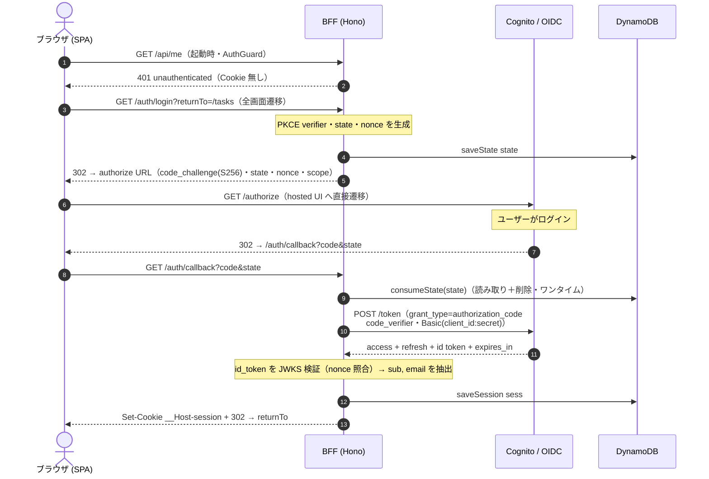
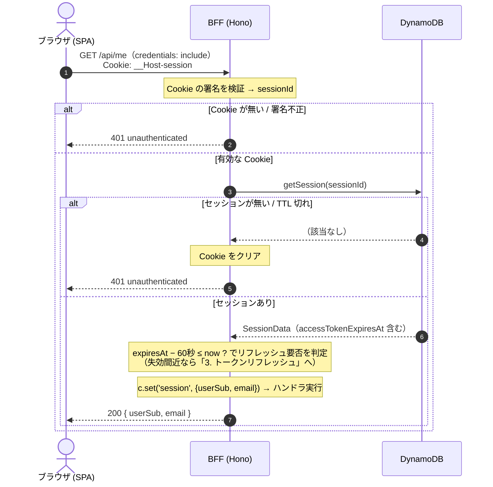
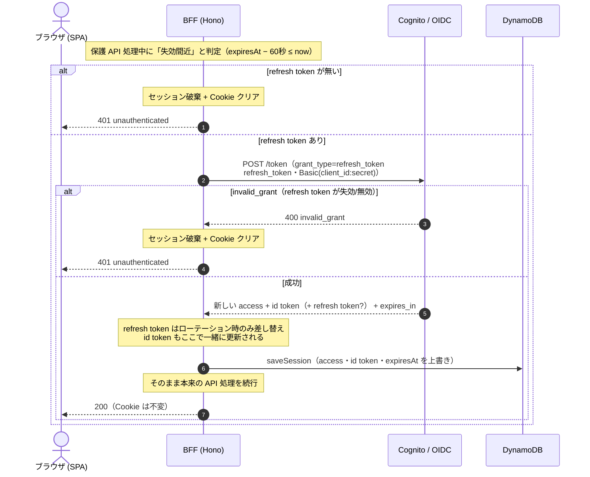
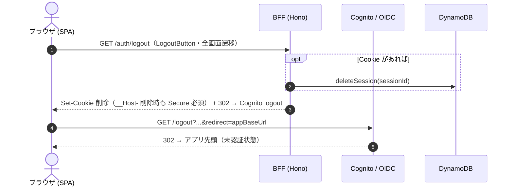

# 認証仕様（BFF パターン）

このドキュメントは、本モノレポの認証がどう動くかを人が読んで理解するための仕様書。
実装は `packages/backend-auth`（`@icasu/backend-auth`）にあり、**このドキュメントとコードが
食い違ったらコードが正**。設計判断の背景やハマりどころは
[`packages/backend-auth/CLAUDE.md`](../../packages/backend-auth/CLAUDE.md) と
`.claude/skills/bff-auth/` を参照。

## 概要

OAuth 2.0 authorization code + PKCE を **BFF（Backend-For-Frontend）パターン**で実装している。
出典は [OAuth 2.0 for Browser-Based Applications](https://datatracker.ietf.org/doc/html/draft-ietf-oauth-browser-based-apps)
の §6（BFF）、Cookie 属性は §6.1.3.2。

- **OIDC プロバイダ**: 本番は Amazon Cognito、ローカルは mock-oauth2-server。**同一コードが両方で動く**
  （差分はすべて `AuthConfig` に注入されるため）。
- **クライアント**: Hono の BFF が **confidential client**（client secret を保持）としてトークン交換する。
- **セッション**: DynamoDB の 1 テーブルに保存。ブラウザには署名付き session id を載せた Cookie だけを返す。

### 中心不変条件 —— ブラウザが手にするトークンはゼロ

> ブラウザが持つのは、不透明・署名付きの session id を載せた **HttpOnly Cookie 1 つだけ**。
> access / refresh / **id** トークンはすべてサーバ側（DynamoDB のセッション行）にだけ存在する。

この一線を崩す変更（トークンを JSON で返す、`localStorage` に入れる、Cookie にアクセストークンを
載せる、API Gateway に JWT authorizer を付ける等）は BFF パターンの否定であり、XSS による
トークン窃取への構造的防御を失う。実装・レビューではこれを最優先で守る。

## 登場人物

| 登場人物           | 実体                                       | 役割                                                                                                                                         |
| ------------------ | ------------------------------------------ | -------------------------------------------------------------------------------------------------------------------------------------------- |
| **ブラウザ (SPA)** | `apps/frontend`（React）                   | `AuthGuard` が `/api/me` でセッションを確認し、未認証なら BFF のログインへ全画面遷移する。トークンには一切触れない。                         |
| **BFF (Hono)**     | `apps/backend` + `@icasu/backend-auth`     | OAuth 遷移（`/auth/*`）と保護 JSON API（`/api/*`）を提供。confidential client としてトークン交換・リフレッシュを行い、セッションを管理する。 |
| **Cognito / OIDC** | 本番 Cognito / ローカル mock-oauth2-server | hosted UI・`/authorize`・`/token`・`/logout` を提供する OIDC プロバイダ。                                                                    |
| **DynamoDB**       | `apps/iac` の sessions テーブル            | 1 テーブルを `pk` で名前空間分け。`state#<state>`（ログイン途中の一時データ）と `sess#<sessionId>`（トークンを含むセッション行）を持つ。     |

### エンドポイントの 2 系統

`/auth`（ブラウザのフルページ遷移）と `/api`（SPA が fetch する JSON API）は**別系統**で、混同しない。

| プレフィックス | 用途                                                                       | 例                                              |
| -------------- | -------------------------------------------------------------------------- | ----------------------------------------------- |
| `/auth/*`      | ブラウザのフルページ遷移（リダイレクト）。RPC からは呼ばない。             | `/auth/login`・`/auth/callback`・`/auth/logout` |
| `/api/*`       | SPA が `credentials: 'include'` で叩く JSON API。Hono RPC の型連携に載る。 | `/api/me`・`/api/tasks`                         |

---

## 1. ログイン

未認証のユーザーがログインし、セッション Cookie を得るまで。authorization code + PKCE フロー。

### 説明

- **トリガー**: SPA 起動時に `AuthGuard` が `/api/me` を取得し、`401 unauthorized` なら
  `redirectToLogin()` が「今いたパス」を `returnTo` に載せて `/auth/login` へ全画面遷移する
  （`apps/frontend/src/features/auth`）。
- **PKCE と state / nonce**: `/auth/login` で code verifier・state・nonce（各 32 バイト乱数）を
  生成し、`state#<state>` として DynamoDB に一時保存（TTL 10 分）。プロバイダには code verifier
  ではなく `code_challenge`（S256 ハッシュ）だけを渡す。
- **hosted UI へは “ブラウザが” 遷移する**: BFF は authorize URL へリダイレクトするだけで、
  hosted UI とやり取りするのはブラウザ本人。ユーザーの資格情報が BFF を通ることはない。
- **コールバックとトークン交換**: プロバイダは `code` を付けて `/auth/callback` へ戻す。BFF は
  `consumeState` で state を**一度だけ**消費（読み取りと同時に削除）して CSRF を防ぎ、
  `code` + `code_verifier` を `/token` に送ってトークンに交換する。confidential client なので
  HTTP Basic（`client_id:client_secret`）で認証する。
- **id_token の検証**: 受け取った id_token を JWKS で署名検証し、issuer・audience・`nonce` を
  照合したうえで `sub`・`email` を取り出す。ここが「本人確認」の要。
- **セッション確立**: トークン一式（access / refresh / **id**）と `accessTokenExpiresAt`・`sub`・
  `email` を `sess#<sessionId>` に保存（TTL 30 日）し、署名付き session id を Cookie で発行する。
- **発行される Cookie**: `HttpOnly` / `SameSite=Strict` / `Path=/` / `Domain` 属性なし。本番は
  `Secure` + `__Host-` プレフィックス付き。属性はすべて `AuthConfig['cookie']` 由来
  （`libs/cookie.ts`）。
- **戻り先の制限**: `returnTo` は同一オリジンのパス（`/` 始まり）だけを許可し、オープン
  リダイレクトを防ぐ。

---

## 2. API 保護（保護ルートへのアクセス）

ログイン済みの SPA が保護 API（`/api/me`・`/api/tasks` など）を叩くときの検証。
`createRequireSession` ミドルウェアが担当する（`packages/backend-auth/src/middleware.ts`）。

### 説明

- **入口は Cookie**: リクエストの `__Host-session` Cookie の署名を検証して `sessionId` を得る。
  Cookie が無い／署名が不正なら即 `401 unauthenticated`。
- **セッション照合**: `sessionId` で `sess#<sessionId>` を引く。行が無い、または TTL 切れ
  （DynamoDB Local は実際には失効させないため、読み取り時にも `ttl` を明示チェックする）なら
  Cookie をクリアして `401`。
- **失効間近の先回りリフレッシュ**: `accessTokenExpiresAt − 60秒 ≤ now`
  （`REFRESH_MARGIN_SECONDS = 60`）ならアクセストークンが失効間近とみなし、透過的にリフレッシュ
  する（→「3. トークンリフレッシュ」）。まだ余裕があればそのまま進む。
- **ハンドラへの受け渡し**: 検証を通ったら `c.set('session', { sessionId, userSub, email })` で
  セッション情報を注入する。以降のハンドラは `c.get('session')` から `userSub` / `email` を
  取れる（保護 API を足すときは `auth.requireSession` を挟み、`tasks/route.ts` と同型にする）。
- **フロント側の扱い**: `401` を受けると `entities/session` の `sessionQuery` が
  `UnauthorizedError` を投げ、`AuthGuard` がログインへ全画面遷移する。それ以外の一時的な
  エラーでは画面を落とさない（API 自体はサーバで保護されているため、確認中に機微情報は漏れない）。

---

## 3. トークンリフレッシュ

API 保護の中で、アクセストークンが**失効間近のときだけ**透過的に走る。ユーザーからは見えない。

### 説明

- **トリガーはアクセストークンの失効間近**: リフレッシュの判定材料は
  `accessTokenExpiresAt` のみで、**id token 単体の exp は見ていない**。id token は「アクセス
  トークンのリフレッシュに付随して」更新される。
- **タイミングは遅延評価**: バックグラウンドの定期更新ではなく、保護 API リクエストを受けた
  その場で必要なら更新する。
- **手段は refresh token**: `grant_type=refresh_token` で `/token` を叩き、新しい access /
  **id** token（プロバイダがローテーションすれば新しい refresh token も）と `expires_in` を得る。
- **id token も一緒に更新される**: `saveSession` で access token・id token・
  `accessTokenExpiresAt` を上書きする。refresh token は**新しい値が返ったときだけ**差し替える
  （ローテーション対応）。
- **失敗時の分岐**:
  - refresh token が無い、または `invalid_grant`（refresh token 自体が失効・無効）→
    **セッションを破棄** + Cookie クリア → `401` → フロントは再ログインへ。
  - それ以外の一過性エラー（プロバイダの一時的な不調など）→ **rethrow してセッションは温存**
    （破棄しない）。
- **設計上の含意**: 現状 id token はログイン時の本人確認（`sub`/`email` 抽出）にしか使っておらず、
  セッション確立後は DynamoDB の `userSub`/`email` を参照するため、id token 単体の失効を独立して
  扱う必要がない。将来、下流 API へ id token を forward する等の要件が出たら、失効判定を id token
  側にも広げる必要がある。

---

## 4. ログアウト

セッションを破棄し、Cookie を消し、プロバイダ側のセッションも終了させる。

### 説明

- **トリガー**: `logout-button`（`features/auth`）が `/auth/logout` へ全画面遷移する。
- **サーバ側セッションの破棄**: Cookie があれば `sess#<sessionId>` を DynamoDB から削除する。
  これでサーバ側のトークンは消える。
- **Cookie の削除**: セッション Cookie を失効（`maxAge:0` の Set-Cookie）させる。**`__Host-`
  プレフィックス付き Cookie は削除時にも `Secure` 属性が必須**で、渡さないと hono が throw して
  500 になる。そのため set 側と同じく `cfg.secure` を渡している（`libs/cookie.ts` の
  `clearSessionCookie`）。
- **プロバイダ側のログアウト**: 最後に Cognito の logout URL へリダイレクトし、`{redirect}` を
  アプリのベース URL に置換して戻す。これでプロバイダの SSO セッションも終了し、未認証状態で
  アプリ先頭に戻る。

---

## 補足: ローカルと本番の切り替え

差分はすべて `AuthConfig` に寄せてあり、パッケージのコードは環境を意識しない。
ホスト（`apps/backend`）が起動時に `loadAuthConfigFromEnv()` を一度呼び、不足 env を全件まとめて
報告して fail fast する。必要な環境変数は `apps/backend/.env.example` を参照。

| 観点                       | ローカル                             | 本番                                |
| -------------------------- | ------------------------------------ | ----------------------------------- |
| OIDC プロバイダ            | mock-oauth2-server（docker-compose） | Amazon Cognito（hosted UI）         |
| セッションストア           | DynamoDB Local                       | DynamoDB                            |
| Cookie                     | `Secure` なし・プレフィックス無し    | `Secure` + `__Host-` プレフィックス |
| `/auth`・`/api` の振り分け | Vite proxy                           | CloudFront                          |

## 関連ファイル

- `packages/backend-auth/src/route.ts` — `/login`・`/callback`・`/logout`（遷移）と `/me`（JSON）
- `packages/backend-auth/src/middleware.ts` — `createRequireSession`（検証＋自動リフレッシュ）
- `packages/backend-auth/src/libs/session.ts` — DynamoDB のセッション & 一時 state ストア
- `packages/backend-auth/src/libs/oidc.ts` — authorize URL・`/token`・logout URL・`TokenError`
- `packages/backend-auth/src/libs/cookie.ts` — 署名付きセッション Cookie
- `apps/frontend/src/features/auth`・`apps/frontend/src/entities/session` — `AuthGuard`・`sessionQuery`
- `apps/iac/src/stacks/web` — Cognito・CloudFront・DynamoDB セッションテーブル
